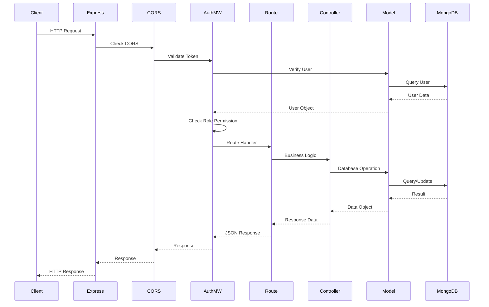
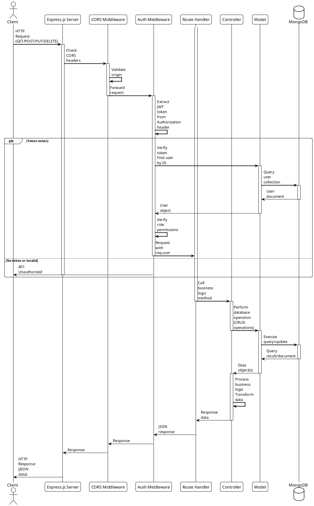
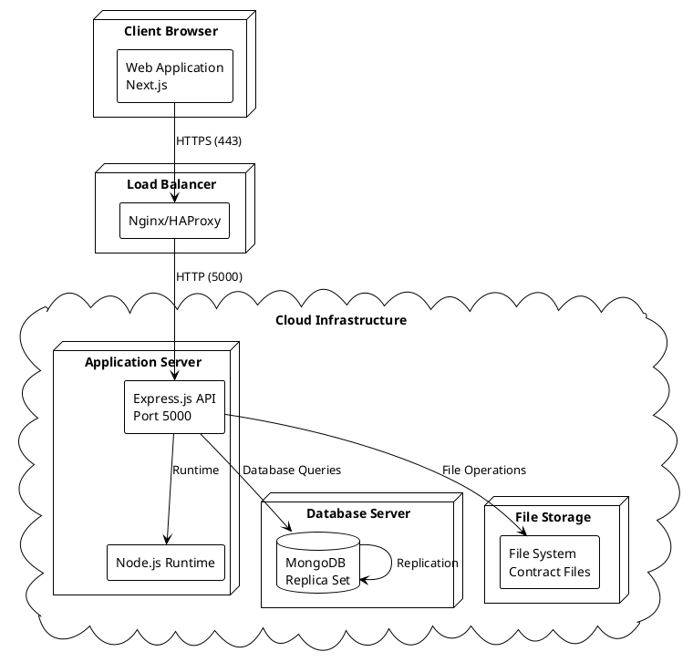

# SDN-BE Database & System Architecture Diagrams

## 1. ERD (Entity Relationship Diagram)

```mermaid
erDiagram
    User ||--o{ Order : "creates"
    User ||--o| Dealer : "belongs_to"
    User ||--o{ Quote : "creates"
    User ||--o{ TestDrive : "assigned_to"
    User ||--o{ Feedback : "created_by"
    User ||--o{ Feedback : "forwarded_to"
    User ||--o{ VehicleRequest : "requested_by"
    User ||--o{ VehicleRequest : "reviewed_by"
    User ||--o{ DealerContract : "created_by"
    
    Dealer ||--o{ User : "has"
    Dealer ||--o{ Customer : "owns"
    Dealer ||--o{ Order : "receives"
    Dealer ||--o{ Quote : "creates"
    Dealer ||--o{ Inventory : "owns"
    Dealer ||--o{ TestDrive : "hosts"
    Dealer ||--o{ Feedback : "receives"
    Dealer ||--o{ VehicleRequest : "requests"
    Dealer ||--o{ DealerContract : "has"
    Dealer ||--o{ Promotion : "targeted_by"
    Dealer ||--o{ InstallmentPlan : "manages"
    
    Customer ||--o{ Order : "places"
    Customer ||--o{ Quote : "receives"
    Customer ||--o{ TestDrive : "requests"
    Customer ||--o{ Feedback : "submits"
    Customer ||--o{ InstallmentPlan : "uses"
    Customer ||--o| Dealer : "owned_by"
    Customer ||--o| User : "owned_by"
    
    VehicleModel ||--o{ VehicleVariant : "has"
    VehicleVariant ||--o{ Inventory : "stored_as"
    VehicleVariant ||--o{ Order : "ordered_in"
    VehicleVariant ||--o{ Quote : "quoted_in"
    VehicleVariant ||--o{ TestDrive : "tested"
    VehicleVariant ||--o{ VehicleRequest : "requested"
    VehicleVariant ||--o{ Promotion : "targeted_by"
    
    VehicleColor ||--o{ Inventory : "has"
    VehicleColor ||--o{ Order : "ordered_in"
    VehicleColor ||--o{ Quote : "quoted_in"
    VehicleColor ||--o{ VehicleRequest : "requested"
    
    Order ||--|| Delivery : "has"
    Order ||--o| Quote : "converted_from"
    Order ||--o| SalesContract : "has"
    Order ||--o{ Payment : "receives"
    Order ||--|| InstallmentPlan : "has"
    Order ||--o| DealerContract : "linked_to"
    
    Quote ||--o{ Promotion : "applies"
    
    Payment ||--o| DealerContract : "for"
    Payment ||--o| InstallmentPlan : "for"
    
    DealerContract ||--o{ Payment : "receives"
    
    InstallmentPlan ||--o{ Payment : "receives"
    
    User {
        ObjectId _id PK
        string email UK
        string passwordHash
        string role
        ObjectId dealer FK
        object profile
        string status
        date createdAt
        date updatedAt
    }
    
    Dealer {
        ObjectId _id PK
        string name
        string code UK
        string region
        string address
        array contacts
        ObjectId contract FK
        number creditLimit
        number salesTarget
        string status
        date createdAt
        date updatedAt
    }
    
    Customer {
        ObjectId _id PK
        string fullName
        string phone
        string email
        string idNumber
        string address
        string segment
        string notes
        ObjectId ownerDealer FK
        ObjectId ownerUser FK
        date createdAt
        date updatedAt
    }
    
    VehicleModel {
        ObjectId _id PK
        string name
        string brand
        string segment
        string description
        boolean active
        date createdAt
        date updatedAt
    }
    
    VehicleVariant {
        ObjectId _id PK
        ObjectId model FK
        string trim UK
        string battery
        number range
        number motorPower
        array features
        number msrp
        array images
        boolean active
        date createdAt
        date updatedAt
    }
    
    VehicleColor {
        ObjectId _id PK
        string name
        string code
        string hex
        number extraPrice
        boolean active
        date createdAt
        date updatedAt
    }
    
    Inventory {
        ObjectId _id PK
        string ownerType
        ObjectId owner FK
        ObjectId variant FK
        ObjectId color FK
        number quantity
        number reserved
        array vinList
        string location
        date createdAt
        date updatedAt
    }
    
    Quote {
        ObjectId _id PK
        ObjectId dealer FK
        ObjectId sales FK
        ObjectId customer FK
        array items
        number subtotal
        number discount
        number promotionTotal
        object fees
        number total
        date validUntil
        string status
        string notes
        date createdAt
        date updatedAt
    }
    
    Order {
        ObjectId _id PK
        string orderNo
        ObjectId dealer FK
        ObjectId sales FK
        ObjectId customer FK
        ObjectId quote FK
        array items
        string paymentMethod
        number deposit
        string status
        date expectedDelivery
        date actualDelivery
        array logs
        date createdAt
        date updatedAt
    }
    
    Payment {
        ObjectId _id PK
        ObjectId order FK
        string type
        number amount
        string method
        string payerType
        ObjectId dealerContract FK
        ObjectId installmentPlan FK
        ObjectId installmentPaymentId
        string transactionRef
        date paidAt
        string status
        string notes
        date createdAt
        date updatedAt
    }
    
    Promotion {
        ObjectId _id PK
        string name
        string scope
        array dealers FK
        array variants FK
        string type
        number value
        boolean stackable
        date validFrom
        date validTo
        string status
        date createdAt
        date updatedAt
    }
    
    Delivery {
        ObjectId _id PK
        ObjectId order FK
        string address
        date scheduledAt
        string status
        string notes
        date createdAt
        date updatedAt
    }
    
    TestDrive {
        ObjectId _id PK
        ObjectId customer FK
        ObjectId dealer FK
        ObjectId variant FK
        date preferredTime
        string status
        object result
        ObjectId assignedStaff FK
        date createdAt
        date updatedAt
    }
    
    Feedback {
        ObjectId _id PK
        ObjectId customer FK
        ObjectId dealer FK
        ObjectId createdBy FK
        string content
        string status
        ObjectId forwardedTo FK
        date forwardedAt
        ObjectId forwardedBy FK
        string forwardedNote
        array logs
        date createdAt
        date updatedAt
    }
    
    SalesContract {
        ObjectId _id PK
        ObjectId order FK
        string contractNo UK
        date signedDate
        array files
        string terms
        string status
        date createdAt
        date updatedAt
    }
    
    DealerContract {
        ObjectId _id PK
        string contractNo UK
        ObjectId dealer FK
        ObjectId order FK
        string contractType
        number totalAmount
        number paidAmount
        number debtAmount
        date signedDate
        date effectiveDate
        date expiryDate
        string status
        string terms
        object discountPolicy
        array files
        ObjectId createdBy FK
        string notes
        date createdAt
        date updatedAt
    }
    
    InstallmentPlan {
        ObjectId _id PK
        ObjectId order FK UK
        ObjectId customer FK
        ObjectId dealer FK
        number totalAmount
        number paidAmount
        number remainingAmount
        number installmentCount
        string installmentPeriod
        array payments
        date startDate
        string status
        string notes
        date createdAt
        date updatedAt
    }
    
    VehicleRequest {
        ObjectId _id PK
        string requestNo UK
        ObjectId dealer FK
        ObjectId requestedBy FK
        array items
        string status
        date requestedAt
        date reviewedAt
        ObjectId reviewedBy FK
        string rejectionReason
        string notes
        array logs
        date createdAt
        date updatedAt
    }
```

## 2. Physical Database Diagram

```mermaid
erDiagram
    users {
        ObjectId _id PK "Primary Key"
        string email UK "Unique Index"
        string passwordHash "Encrypted"
        string role "Enum: DealerStaff, DealerManager, EVMStaff, Admin"
        ObjectId dealer FK "Indexed"
        object profile "Embedded"
        string status "Index: active, locked"
        timestamp createdAt
        timestamp updatedAt
    }
    
    dealers {
        ObjectId _id PK "Primary Key"
        string code UK "Unique Index"
        string name
        string region
        string address
        array contacts "Embedded Array"
        ObjectId contract FK "Indexed"
        number creditLimit
        number salesTarget
        string status "Index: active, inactive"
        timestamp createdAt
        timestamp updatedAt
    }
    
    customers {
        ObjectId _id PK "Primary Key"
        string phone "Index"
        string email "Index"
        string fullName
        string idNumber
        string address
        string segment "Enum: retail, fleet"
        ObjectId ownerDealer FK "Indexed"
        ObjectId ownerUser FK "Indexed"
        string notes
        timestamp createdAt
        timestamp updatedAt
    }
    
    vehiclemodels {
        ObjectId _id PK "Primary Key"
        string name
        string brand "Default: EVM"
        string segment
        string description
        boolean active
        timestamp createdAt
        timestamp updatedAt
    }
    
    vehiclevariants {
        ObjectId _id PK "Primary Key"
        ObjectId model FK "Indexed"
        string trim "Compound UK: model+trim"
        string battery
        number range
        number motorPower
        array features
        number msrp
        array images
        boolean active
        timestamp createdAt
        timestamp updatedAt
        index compound "model_1_trim_1 unique"
    }
    
    vehiclecolors {
        ObjectId _id PK "Primary Key"
        string name
        string code
        string hex
        number extraPrice
        boolean active
        timestamp createdAt
        timestamp updatedAt
    }
    
    inventories {
        ObjectId _id PK "Primary Key"
        string ownerType "Enum: EVM, Dealer - Indexed"
        ObjectId owner FK "Indexed (sparse)"
        ObjectId variant FK "Indexed"
        ObjectId color FK "Indexed"
        number quantity
        number reserved
        array vinList
        string location
        timestamp createdAt
        timestamp updatedAt
        index compound "ownerType_1_owner_1_variant_1_color_1 unique sparse"
    }
    
    quotes {
        ObjectId _id PK "Primary Key"
        ObjectId dealer FK "Indexed"
        ObjectId sales FK "Indexed"
        ObjectId customer FK "Indexed"
        array items "Embedded Array: variant, color, qty, unitPrice, promotions"
        number subtotal
        number discount
        number promotionTotal
        object fees "Embedded: registration, plate, delivery"
        number total
        date validUntil
        string status "Enum: draft, sent, accepted, rejected"
        string notes
        timestamp createdAt
        timestamp updatedAt
    }
    
    orders {
        ObjectId _id PK "Primary Key"
        string orderNo "Indexed"
        ObjectId dealer FK "Indexed"
        ObjectId sales FK "Indexed"
        ObjectId customer FK "Indexed"
        ObjectId quote FK "Indexed"
        array items "Embedded Array: variant, color, qty, unitPrice, vins"
        string paymentMethod "Enum: cash, finance"
        number deposit
        string status "Enum: new, confirmed, allocated, invoiced, delivered, cancelled"
        date expectedDelivery
        date actualDelivery
        array logs "Embedded Array"
        timestamp createdAt
        timestamp updatedAt
    }
    
    payments {
        ObjectId _id PK "Primary Key"
        ObjectId order FK "Indexed - Required"
        string type "Enum: deposit, balance, finance"
        number amount
        string method "Enum: cash, bank, loan"
        string payerType "Enum: customer, dealer"
        ObjectId dealerContract FK "Indexed"
        ObjectId installmentPlan FK "Indexed"
        ObjectId installmentPaymentId
        string transactionRef
        date paidAt
        string status "Enum: pending, confirmed, failed"
        string notes
        timestamp createdAt
        timestamp updatedAt
    }
    
    promotions {
        ObjectId _id PK "Primary Key"
        string name
        string scope "Enum: global, byDealer, byVariant"
        array dealers FK "Array of ObjectIds"
        array variants FK "Array of ObjectIds"
        string type "Enum: cashback, accessory, finance"
        number value
        boolean stackable
        date validFrom
        date validTo
        string status "Enum: active, inactive"
        timestamp createdAt
        timestamp updatedAt
    }
    
    deliveries {
        ObjectId _id PK "Primary Key"
        ObjectId order FK "Indexed - Required"
        string address
        date scheduledAt
        string status "Enum: pending, in_progress, delivered"
        string notes
        timestamp createdAt
        timestamp updatedAt
    }
    
    testdrives {
        ObjectId _id PK "Primary Key"
        ObjectId customer FK "Indexed - Required"
        ObjectId dealer FK "Indexed - Required"
        ObjectId variant FK "Indexed - Required"
        date preferredTime
        string status "Enum: requested, confirmed, done, cancelled"
        object result "Embedded: feedback, interestRate"
        ObjectId assignedStaff FK "Indexed"
        timestamp createdAt
        timestamp updatedAt
    }
    
    feedbacks {
        ObjectId _id PK "Primary Key"
        ObjectId customer FK "Indexed"
        ObjectId dealer FK "Indexed"
        ObjectId createdBy FK "Indexed"
        string content
        string status "Enum: new, in_progress, resolved"
        ObjectId forwardedTo FK "Indexed"
        date forwardedAt
        ObjectId forwardedBy FK "Indexed"
        string forwardedNote
        array logs "Embedded Array"
        timestamp createdAt
        timestamp updatedAt
    }
    
    salescontracts {
        ObjectId _id PK "Primary Key"
        ObjectId order FK "Indexed - Required"
        string contractNo UK "Unique Index"
        date signedDate
        array files
        string terms
        string status "Enum: draft, signed, cancelled"
        timestamp createdAt
        timestamp updatedAt
    }
    
    dealercontracts {
        ObjectId _id PK "Primary Key"
        string contractNo UK "Unique Index"
        ObjectId dealer FK "Indexed"
        ObjectId order FK "Indexed"
        string contractType "Enum: distribution, purchase, consignment"
        number totalAmount
        number paidAmount
        number debtAmount "Calculated: totalAmount - paidAmount"
        date signedDate
        date effectiveDate
        date expiryDate
        string status "Enum: draft, active, completed, cancelled"
        string terms
        object discountPolicy "Embedded: discountRate, creditLimit, paymentTerm"
        array files
        ObjectId createdBy FK "Indexed"
        string notes
        timestamp createdAt
        timestamp updatedAt
        index status "status_1"
    }
    
    installmentplans {
        ObjectId _id PK "Primary Key"
        ObjectId order FK UK "Unique Index - Required"
        ObjectId customer FK "Indexed - Required"
        ObjectId dealer FK "Indexed - Required"
        number totalAmount
        number paidAmount
        number remainingAmount "Calculated: totalAmount - paidAmount"
        number installmentCount "Min: 1"
        string installmentPeriod "Enum: monthly, quarterly, yearly"
        array payments "Embedded Array: InstallmentPayment"
        date startDate
        string status "Enum: active, completed, cancelled"
        string notes
        timestamp createdAt
        timestamp updatedAt
        index customer "customer_1"
        index dealer "dealer_1"
        index status "status_1"
    }
    
    vehiclerequests {
        ObjectId _id PK "Primary Key"
        string requestNo UK "Unique Index - Auto-generated"
        ObjectId dealer FK "Indexed - Required"
        ObjectId requestedBy FK "Indexed - Required"
        array items "Embedded Array: variant, color, quantity, reason"
        string status "Enum: pending, approved, rejected, fulfilled, cancelled"
        date requestedAt
        date reviewedAt
        ObjectId reviewedBy FK "Indexed"
        string rejectionReason
        string notes
        array logs "Embedded Array"
        timestamp createdAt
        timestamp updatedAt
    }
    
    users ||--o{ orders : "creates"
    users ||--o| dealers : "belongs_to"
    dealers ||--o{ customers : "owns"
    dealers ||--o{ orders : "receives"
    dealers ||--o{ inventories : "owns"
    customers ||--o{ orders : "places"
    vehiclemodels ||--o{ vehiclevariants : "has"
    vehiclevariants ||--o{ inventories : "stored_as"
    vehiclevariants ||--o{ orders : "ordered_in"
    vehiclecolors ||--o{ inventories : "has"
    orders ||--|| deliveries : "has"
    orders ||--o{ payments : "receives"
    orders ||--|| installmentplans : "has"
    dealercontracts ||--o{ payments : "receives"
    installmentplans ||--o{ payments : "receives"
```

## 3. System Architecture Diagram

```mermaid
graph TB
    subgraph "Client Layer"
        FE[Frontend Application<br/>Next.js/React]
    end
    
    subgraph "API Gateway"
        API[Express.js Server<br/>Port 5000]
        CORS[CORS Middleware]
        AUTH_MW[Authentication Middleware<br/>JWT Token Validation]
        ROLE_MW[Role-based Authorization<br/>DealerStaff, DealerManager, EVMStaff, Admin]
    end
    
    subgraph "Route Layer"
        AUTH_R[Auth Routes<br/>/api/auth]
        VEHICLE_R[Vehicle Routes<br/>/api/vehicles]
        DEALER_R[Dealer Routes<br/>/api/dealers]
        CUSTOMER_R[Customer Routes<br/>/api/customers]
        ORDER_R[Order Routes<br/>/api/orders]
        QUOTE_R[Quote Routes<br/>/api/quotes]
        INVENTORY_R[Inventory Routes<br/>/api/inventory]
        PAYMENT_R[Payment Routes<br/>/api/payments]
        PROMO_R[Promotion Routes<br/>/api/promotions]
        DELIVERY_R[Delivery Routes<br/>/api/deliveries]
        TEST_R[Test Drive Routes<br/>/api/test-drives]
        FEEDBACK_R[Feedback Routes<br/>/api/feedbacks]
        CONTRACT_R[Contract Routes<br/>/api/contracts]
        DASH_R[Dashboard Routes<br/>/api/dashboard]
        REPORT_R[Report Routes<br/>/api/reports]
        VR_R[Vehicle Request Routes<br/>/api/vehicle-requests]
        INSTALL_R[Installment Routes<br/>/api/installment-plans]
        DC_R[Dealer Contract Routes<br/>/api/dealer-contracts]
        VM_R[Vehicle Model Routes<br/>/api/vehicle-models]
        VC_R[Vehicle Color Routes<br/>/api/vehicle-colors]
        USER_R[User Routes<br/>/api/users]
    end
    
    subgraph "Controller Layer"
        AUTH_C[Auth Controller<br/>login, register, profile]
        VEHICLE_C[Vehicle Controller<br/>CRUD operations]
        DEALER_C[Dealer Controller<br/>management]
        CUSTOMER_C[Customer Controller<br/>management]
        ORDER_C[Order Controller<br/>create, update, track]
        QUOTE_C[Quote Controller<br/>create, convert to order]
        INVENTORY_C[Inventory Controller<br/>stock management]
        PAYMENT_C[Payment Controller<br/>payment processing]
        PROMO_C[Promotion Controller<br/>discount management]
        DELIVERY_C[Delivery Controller<br/>tracking]
        TEST_C[Test Drive Controller<br/>appointment management]
        FEEDBACK_C[Feedback Controller<br/>customer feedback]
        CONTRACT_C[Contract Controller<br/>sales contracts]
        DASH_C[Dashboard Controller<br/>statistics]
        REPORT_C[Report Controller<br/>analytics]
        VR_C[Vehicle Request Controller<br/>dealer requests]
        INSTALL_C[Installment Controller<br/>payment plans]
        DC_C[Dealer Contract Controller<br/>contracts]
        VM_C[Vehicle Model Controller]
        VC_C[Vehicle Color Controller]
        USER_C[User Controller]
    end
    
    subgraph "Model Layer"
        USER_M[User Model]
        DEALER_M[Dealer Model]
        CUSTOMER_M[Customer Model]
        VEHICLE_M[Vehicle Model]
        VARIANT_M[Vehicle Variant Model]
        COLOR_M[Vehicle Color Model]
        INVENTORY_M[Inventory Model]
        QUOTE_M[Quote Model]
        ORDER_M[Order Model]
        PAYMENT_M[Payment Model]
        PROMO_M[Promotion Model]
        DELIVERY_M[Delivery Model]
        TEST_M[Test Drive Model]
        FEEDBACK_M[Feedback Model]
        CONTRACT_M[Sales Contract Model]
        DC_M[Dealer Contract Model]
        INSTALL_M[Installment Plan Model]
        VR_M[Vehicle Request Model]
    end
    
    subgraph "Data Layer"
        MONGO[(MongoDB Database<br/>Mongoose ODM)]
    end
    
    subgraph "Utilities"
        JWT_UTIL[JWT Utils<br/>token generation/verification]
        HASH_UTIL[Hash Utils<br/>bcrypt password hashing]
    end
    
    subgraph "Documentation"
        SWAGGER[Swagger UI<br/>/api-docs]
    end
    
    FE -->|HTTPS Requests| API
    API --> CORS
    CORS --> AUTH_MW
    AUTH_MW --> ROLE_MW
    
    ROLE_MW --> AUTH_R
    ROLE_MW --> VEHICLE_R
    ROLE_MW --> DEALER_R
    ROLE_MW --> CUSTOMER_R
    ROLE_MW --> ORDER_R
    ROLE_MW --> QUOTE_R
    ROLE_MW --> INVENTORY_R
    ROLE_MW --> PAYMENT_R
    ROLE_MW --> PROMO_R
    ROLE_MW --> DELIVERY_R
    ROLE_MW --> TEST_R
    ROLE_MW --> FEEDBACK_R
    ROLE_MW --> CONTRACT_R
    ROLE_MW --> DASH_R
    ROLE_MW --> REPORT_R
    ROLE_MW --> VR_R
    ROLE_MW --> INSTALL_R
    ROLE_MW --> DC_R
    ROLE_MW --> VM_R
    ROLE_MW --> VC_R
    ROLE_MW --> USER_R
    
    AUTH_R --> AUTH_C
    VEHICLE_R --> VEHICLE_C
    DEALER_R --> DEALER_C
    CUSTOMER_R --> CUSTOMER_C
    ORDER_R --> ORDER_C
    QUOTE_R --> QUOTE_C
    INVENTORY_R --> INVENTORY_C
    PAYMENT_R --> PAYMENT_C
    PROMO_R --> PROMO_C
    DELIVERY_R --> DELIVERY_C
    TEST_R --> TEST_C
    FEEDBACK_R --> FEEDBACK_C
    CONTRACT_R --> CONTRACT_C
    DASH_R --> DASH_C
    REPORT_R --> REPORT_C
    VR_R --> VR_C
    INSTALL_R --> INSTALL_C
    DC_R --> DC_C
    VM_R --> VM_C
    VC_R --> VC_C
    USER_R --> USER_C
    
    AUTH_C --> USER_M
    AUTH_C --> JWT_UTIL
    AUTH_C --> HASH_UTIL
    VEHICLE_C --> VARIANT_M
    DEALER_C --> DEALER_M
    CUSTOMER_C --> CUSTOMER_M
    ORDER_C --> ORDER_M
    QUOTE_C --> QUOTE_M
    INVENTORY_C --> INVENTORY_M
    PAYMENT_C --> PAYMENT_M
    PROMO_C --> PROMO_M
    DELIVERY_C --> DELIVERY_M
    TEST_C --> TEST_M
    FEEDBACK_C --> FEEDBACK_M
    CONTRACT_C --> CONTRACT_M
    DASH_C --> USER_M
    DASH_C --> ORDER_M
    DASH_C --> DEALER_M
    REPORT_C --> ORDER_M
    REPORT_C --> PAYMENT_M
    REPORT_C --> DEALER_M
    VR_C --> VR_M
    INSTALL_C --> INSTALL_M
    DC_C --> DC_M
    VM_C --> VEHICLE_M
    VC_C --> COLOR_M
    USER_C --> USER_M
    
    USER_M --> MONGO
    DEALER_M --> MONGO
    CUSTOMER_M --> MONGO
    VEHICLE_M --> MONGO
    VARIANT_M --> MONGO
    COLOR_M --> MONGO
    INVENTORY_M --> MONGO
    QUOTE_M --> MONGO
    ORDER_M --> MONGO
    PAYMENT_M --> MONGO
    PROMO_M --> MONGO
    DELIVERY_M --> MONGO
    TEST_M --> MONGO
    FEEDBACK_M --> MONGO
    CONTRACT_M --> MONGO
    DC_M --> MONGO
    INSTALL_M --> MONGO
    VR_M --> MONGO
    
    API --> SWAGGER
    
    style FE fill:#e1f5ff
    style API fill:#fff4e1
    style MONGO fill:#ffe1f5
    style SWAGGER fill:#e1ffe1
```



## 4. Request Flow Diagram



## 5. Technology Stack

### Backend
- **Runtime**: Node.js
- **Framework**: Express.js 5.1.0
- **Database**: MongoDB (Mongoose ODM 8.18.3)
- **Authentication**: JWT (jsonwebtoken 9.0.2)
- **Password Hashing**: bcryptjs 3.0.2
- **CORS**: cors 2.8.5
- **Documentation**: Swagger UI Express 5.0.1

### Security
- JWT-based authentication
- Role-based access control (RBAC)
- Password hashing with bcrypt
- CORS protection
- Token validation middleware

### Database Features
- MongoDB with Mongoose ODM
- Indexed fields for performance
- Embedded documents for related data
- Unique constraints
- Timestamps (createdAt, updatedAt)
- Pre-save hooks for calculated fields

## 6. Key Relationships Summary

### One-to-Many Relationships
- User → Orders (sales person creates orders)
- Dealer → Users (dealer has multiple staff)
- Dealer → Customers (dealer owns customers)
- Dealer → Orders (dealer receives orders)
- Customer → Orders (customer places orders)
- VehicleModel → VehicleVariant (model has variants)
- Order → Payments (order receives multiple payments)
- Order → Delivery (order has one delivery)

### One-to-One Relationships
- Order → SalesContract (one order, one contract)
- Order → InstallmentPlan (one order, one plan)
- Order → Delivery (one order, one delivery)

### Many-to-Many Relationships
- Promotion ↔ Dealers (promotions target multiple dealers)
- Promotion ↔ VehicleVariant (promotions apply to variants)

### Embedded Documents
- Order.items (VehicleVariant, Color, Quantity, Price, VINs)
- Quote.items (VehicleVariant, Color, Quantity, Price, Promotions)
- Inventory.vinList (array of VIN numbers)
- InstallmentPlan.payments (array of installment payments)
- VehicleRequest.items (variant, color, quantity requests)

---

# PlantUML Diagrams

## 1. ERD (Entity Relationship Diagram) - PlantUML

```plantuml
@startuml ERD
!theme plain
skinparam linetype ortho
skinparam packageStyle rectangle

entity "User" as User {
  * _id : ObjectId <<PK>>
  * email : String <<UK>>
  * passwordHash : String
  * role : Enum
  --
  dealer : ObjectId <<FK>>
  profile : Object
  status : String
  createdAt : Date
  updatedAt : Date
}

entity "Dealer" as Dealer {
  * _id : ObjectId <<PK>>
  * name : String
  * code : String <<UK>>
  --
  region : String
  address : String
  contacts : Array
  contract : ObjectId <<FK>>
  creditLimit : Number
  salesTarget : Number
  status : String
  createdAt : Date
  updatedAt : Date
}

entity "Customer" as Customer {
  * _id : ObjectId <<PK>>
  * fullName : String
  phone : String <<I>>
  email : String <<I>>
  --
  idNumber : String
  address : String
  segment : Enum
  ownerDealer : ObjectId <<FK>>
  ownerUser : ObjectId <<FK>>
  notes : String
  createdAt : Date
  updatedAt : Date
}

entity "VehicleModel" as VehicleModel {
  * _id : ObjectId <<PK>>
  * name : String
  --
  brand : String
  segment : String
  description : String
  active : Boolean
  createdAt : Date
  updatedAt : Date
}

entity "VehicleVariant" as VehicleVariant {
  * _id : ObjectId <<PK>>
  * model : ObjectId <<FK>>
  * trim : String <<UK>>
  --
  battery : String
  range : Number
  motorPower : Number
  features : Array
  msrp : Number
  images : Array
  active : Boolean
  createdAt : Date
  updatedAt : Date
}

entity "VehicleColor" as VehicleColor {
  * _id : ObjectId <<PK>>
  * name : String
  --
  code : String
  hex : String
  extraPrice : Number
  active : Boolean
  createdAt : Date
  updatedAt : Date
}

entity "Inventory" as Inventory {
  * _id : ObjectId <<PK>>
  * ownerType : Enum
  owner : ObjectId <<FK>>
  * variant : ObjectId <<FK>>
  color : ObjectId <<FK>>
  --
  quantity : Number
  reserved : Number
  vinList : Array
  location : String
  createdAt : Date
  updatedAt : Date
}

entity "Quote" as Quote {
  * _id : ObjectId <<PK>>
  * dealer : ObjectId <<FK>>
  sales : ObjectId <<FK>>
  * customer : ObjectId <<FK>>
  --
  items : Array
  subtotal : Number
  discount : Number
  promotionTotal : Number
  fees : Object
  total : Number
  validUntil : Date
  status : Enum
  notes : String
  createdAt : Date
  updatedAt : Date
}

entity "Order" as Order {
  * _id : ObjectId <<PK>>
  orderNo : String <<I>>
  * dealer : ObjectId <<FK>>
  sales : ObjectId <<FK>>
  * customer : ObjectId <<FK>>
  quote : ObjectId <<FK>>
  --
  items : Array
  paymentMethod : Enum
  deposit : Number
  status : Enum
  expectedDelivery : Date
  actualDelivery : Date
  logs : Array
  createdAt : Date
  updatedAt : Date
}

entity "Payment" as Payment {
  * _id : ObjectId <<PK>>
  * order : ObjectId <<FK>>
  * type : Enum
  * amount : Number
  * method : Enum
  --
  payerType : Enum
  dealerContract : ObjectId <<FK>>
  installmentPlan : ObjectId <<FK>>
  installmentPaymentId : ObjectId
  transactionRef : String
  paidAt : Date
  status : Enum
  notes : String
  createdAt : Date
  updatedAt : Date
}

entity "Promotion" as Promotion {
  * _id : ObjectId <<PK>>
  * name : String
  * scope : Enum
  --
  dealers : Array <<FK>>
  variants : Array <<FK>>
  type : Enum
  value : Number
  stackable : Boolean
  validFrom : Date
  validTo : Date
  status : Enum
  createdAt : Date
  updatedAt : Date
}

entity "Delivery" as Delivery {
  * _id : ObjectId <<PK>>
  * order : ObjectId <<FK>>
  --
  address : String
  scheduledAt : Date
  status : Enum
  notes : String
  createdAt : Date
  updatedAt : Date
}

entity "TestDrive" as TestDrive {
  * _id : ObjectId <<PK>>
  * customer : ObjectId <<FK>>
  * dealer : ObjectId <<FK>>
  * variant : ObjectId <<FK>>
  --
  preferredTime : Date
  status : Enum
  result : Object
  assignedStaff : ObjectId <<FK>>
  createdAt : Date
  updatedAt : Date
}

entity "Feedback" as Feedback {
  * _id : ObjectId <<PK>>
  customer : ObjectId <<FK>>
  dealer : ObjectId <<FK>>
  createdBy : ObjectId <<FK>>
  * content : String
  --
  status : Enum
  forwardedTo : ObjectId <<FK>>
  forwardedAt : Date
  forwardedBy : ObjectId <<FK>>
  forwardedNote : String
  logs : Array
  createdAt : Date
  updatedAt : Date
}

entity "SalesContract" as SalesContract {
  * _id : ObjectId <<PK>>
  * order : ObjectId <<FK>>
  * contractNo : String <<UK>>
  --
  signedDate : Date
  files : Array
  terms : String
  status : Enum
  createdAt : Date
  updatedAt : Date
}

entity "DealerContract" as DealerContract {
  * _id : ObjectId <<PK>>
  * contractNo : String <<UK>>
  * dealer : ObjectId <<FK>>
  order : ObjectId <<FK>>
  --
  contractType : Enum
  totalAmount : Number
  paidAmount : Number
  debtAmount : Number
  signedDate : Date
  effectiveDate : Date
  expiryDate : Date
  status : Enum
  terms : String
  discountPolicy : Object
  files : Array
  createdBy : ObjectId <<FK>>
  notes : String
  createdAt : Date
  updatedAt : Date
}

entity "InstallmentPlan" as InstallmentPlan {
  * _id : ObjectId <<PK>>
  * order : ObjectId <<FK,UK>>
  * customer : ObjectId <<FK>>
  * dealer : ObjectId <<FK>>
  * totalAmount : Number
  --
  paidAmount : Number
  remainingAmount : Number
  installmentCount : Number
  installmentPeriod : Enum
  payments : Array
  startDate : Date
  status : Enum
  notes : String
  createdAt : Date
  updatedAt : Date
}

entity "VehicleRequest" as VehicleRequest {
  * _id : ObjectId <<PK>>
  * requestNo : String <<UK>>
  * dealer : ObjectId <<FK>>
  * requestedBy : ObjectId <<FK>>
  --
  items : Array
  status : Enum
  requestedAt : Date
  reviewedAt : Date
  reviewedBy : ObjectId <<FK>>
  rejectionReason : String
  notes : String
  logs : Array
  createdAt : Date
  updatedAt : Date
}

' Relationships
User }o--|| Dealer : "belongs_to"
User ||--o{ Order : "creates"
User ||--o{ Quote : "creates"
User ||--o{ TestDrive : "assigned_to"
User ||--o{ Feedback : "created_by"
User ||--o{ Feedback : "forwarded_to"
User ||--o{ VehicleRequest : "requested_by"
User ||--o{ VehicleRequest : "reviewed_by"
User ||--o{ DealerContract : "created_by"

Dealer ||--o{ User : "has"
Dealer ||--o{ Customer : "owns"
Dealer ||--o{ Order : "receives"
Dealer ||--o{ Quote : "creates"
Dealer ||--o{ Inventory : "owns"
Dealer ||--o{ TestDrive : "hosts"
Dealer ||--o{ Feedback : "receives"
Dealer ||--o{ VehicleRequest : "requests"
Dealer }o--|| DealerContract : "has"
Dealer }o--o{ Promotion : "targeted_by"
Dealer ||--o{ InstallmentPlan : "manages"

Customer ||--o{ Order : "places"
Customer ||--o{ Quote : "receives"
Customer ||--o{ TestDrive : "requests"
Customer ||--o{ Feedback : "submits"
Customer ||--o{ InstallmentPlan : "uses"
Customer }o--|| Dealer : "owned_by"
Customer }o--|| User : "owned_by"

VehicleModel ||--o{ VehicleVariant : "has"
VehicleVariant ||--o{ Inventory : "stored_as"
VehicleVariant ||--o{ Order : "ordered_in"
VehicleVariant ||--o{ Quote : "quoted_in"
VehicleVariant ||--o{ TestDrive : "tested"
VehicleVariant ||--o{ VehicleRequest : "requested"
VehicleVariant }o--o{ Promotion : "targeted_by"

VehicleColor ||--o{ Inventory : "has"
VehicleColor ||--o{ Order : "ordered_in"
VehicleColor ||--o{ Quote : "quoted_in"
VehicleColor ||--o{ VehicleRequest : "requested"

Order ||--|| Delivery : "has"
Order }o--|| Quote : "converted_from"
Order ||--|| SalesContract : "has"
Order ||--o{ Payment : "receives"
Order ||--|| InstallmentPlan : "has"
Order }o--|| DealerContract : "linked_to"

Quote }o--o{ Promotion : "applies"

Payment }o--|| DealerContract : "for"
Payment }o--|| InstallmentPlan : "for"

DealerContract ||--o{ Payment : "receives"

InstallmentPlan ||--o{ Payment : "receives"

@enduml
```



## 2. Physical Database Diagram - PlantUML

```plantuml
@startuml PhysicalDatabase
!theme plain
skinparam linetype ortho

database "SDN Database" {
  
  table users {
    * _id : ObjectId <<PK>>
    * email : String <<UK, I>>
    * passwordHash : String <<encrypted>>
    * role : Enum <<I>>
    dealer_id : ObjectId <<FK, I>>
    profile_name : String
    profile_phone : String
    status : Enum <<I>>
    createdAt : Timestamp
    updatedAt : Timestamp
    --
    Indexes:
    email (unique)
    dealer_id
    status
    role
  }
  
  table dealers {
    * _id : ObjectId <<PK>>
    * code : String <<UK, I>>
    name : String
    region : String
    address : String
    contacts : Array <<embedded>>
    contract_id : ObjectId <<FK, I>>
    creditLimit : Number
    salesTarget : Number
    status : Enum <<I>>
    createdAt : Timestamp
    updatedAt : Timestamp
    --
    Indexes:
    code (unique)
    contract_id
    status
  }
  
  table customers {
    * _id : ObjectId <<PK>>
    * fullName : String
    phone : String <<I>>
    email : String <<I>>
    idNumber : String
    address : String
    segment : Enum
    ownerDealer_id : ObjectId <<FK, I>>
    ownerUser_id : ObjectId <<FK, I>>
    notes : String
    createdAt : Timestamp
    updatedAt : Timestamp
    --
    Indexes:
    phone
    email
    ownerDealer_id
    ownerUser_id
  }
  
  table vehiclemodels {
    * _id : ObjectId <<PK>>
    name : String
    brand : String
    segment : String
    description : String
    active : Boolean
    createdAt : Timestamp
    updatedAt : Timestamp
  }
  
  table vehiclevariants {
    * _id : ObjectId <<PK>>
    * model_id : ObjectId <<FK, I>>
    * trim : String <<UK>>
    battery : String
    range : Number
    motorPower : Number
    features : Array
    msrp : Number
    images : Array
    active : Boolean
    createdAt : Timestamp
    updatedAt : Timestamp
    --
    Indexes:
    model_id + trim (unique compound)
  }
  
  table vehiclecolors {
    * _id : ObjectId <<PK>>
    name : String
    code : String
    hex : String
    extraPrice : Number
    active : Boolean
    createdAt : Timestamp
    updatedAt : Timestamp
  }
  
  table inventories {
    * _id : ObjectId <<PK>>
    * ownerType : Enum <<I>>
    owner_id : ObjectId <<FK, I>>
    * variant_id : ObjectId <<FK, I>>
    color_id : ObjectId <<FK, I>>
    quantity : Number
    reserved : Number
    vinList : Array
    location : String
    createdAt : Timestamp
    updatedAt : Timestamp
    --
    Indexes:
    ownerType + owner_id + variant_id + color_id (unique compound, sparse)
  }
  
  table quotes {
    * _id : ObjectId <<PK>>
    dealer_id : ObjectId <<FK, I>>
    sales_id : ObjectId <<FK, I>>
    customer_id : ObjectId <<FK, I>>
    items : Array <<embedded>>
    subtotal : Number
    discount : Number
    promotionTotal : Number
    fees : Object <<embedded>>
    total : Number
    validUntil : Date
    status : Enum
    notes : String
    createdAt : Timestamp
    updatedAt : Timestamp
    --
    Indexes:
    dealer_id
    sales_id
    customer_id
  }
  
  table orders {
    * _id : ObjectId <<PK>>
    orderNo : String <<I>>
    dealer_id : ObjectId <<FK, I>>
    sales_id : ObjectId <<FK, I>>
    customer_id : ObjectId <<FK, I>>
    quote_id : ObjectId <<FK, I>>
    items : Array <<embedded>>
    paymentMethod : Enum
    deposit : Number
    status : Enum
    expectedDelivery : Date
    actualDelivery : Date
    logs : Array <<embedded>>
    createdAt : Timestamp
    updatedAt : Timestamp
    --
    Indexes:
    orderNo
    dealer_id
    sales_id
    customer_id
    quote_id
  }
  
  table payments {
    * _id : ObjectId <<PK>>
    * order_id : ObjectId <<FK, I>>
    * type : Enum
    * amount : Number
    * method : Enum
    payerType : Enum
    dealerContract_id : ObjectId <<FK, I>>
    installmentPlan_id : ObjectId <<FK, I>>
    installmentPaymentId : ObjectId
    transactionRef : String
    paidAt : Date
    status : Enum
    notes : String
    createdAt : Timestamp
    updatedAt : Timestamp
    --
    Indexes:
    order_id
    dealerContract_id
    installmentPlan_id
  }
  
  table promotions {
    * _id : ObjectId <<PK>>
    name : String
    scope : Enum
    dealers : Array <<FK array>>
    variants : Array <<FK array>>
    type : Enum
    value : Number
    stackable : Boolean
    validFrom : Date
    validTo : Date
    status : Enum
    createdAt : Timestamp
    updatedAt : Timestamp
  }
  
  table deliveries {
    * _id : ObjectId <<PK>>
    * order_id : ObjectId <<FK, I>>
    address : String
    scheduledAt : Date
    status : Enum
    notes : String
    createdAt : Timestamp
    updatedAt : Timestamp
    --
    Indexes:
    order_id
  }
  
  table testdrives {
    * _id : ObjectId <<PK>>
    * customer_id : ObjectId <<FK, I>>
    * dealer_id : ObjectId <<FK, I>>
    * variant_id : ObjectId <<FK, I>>
    preferredTime : Date
    status : Enum
    result : Object <<embedded>>
    assignedStaff_id : ObjectId <<FK, I>>
    createdAt : Timestamp
    updatedAt : Timestamp
    --
    Indexes:
    customer_id
    dealer_id
    variant_id
    assignedStaff_id
  }
  
  table feedbacks {
    * _id : ObjectId <<PK>>
    customer_id : ObjectId <<FK, I>>
    dealer_id : ObjectId <<FK, I>>
    createdBy_id : ObjectId <<FK, I>>
    * content : String
    status : Enum
    forwardedTo_id : ObjectId <<FK, I>>
    forwardedAt : Date
    forwardedBy_id : ObjectId <<FK, I>>
    forwardedNote : String
    logs : Array <<embedded>>
    createdAt : Timestamp
    updatedAt : Timestamp
    --
    Indexes:
    customer_id
    dealer_id
    createdBy_id
    forwardedTo_id
    forwardedBy_id
  }
  
  table salescontracts {
    * _id : ObjectId <<PK>>
    * order_id : ObjectId <<FK, I>>
    * contractNo : String <<UK, I>>
    signedDate : Date
    files : Array
    terms : String
    status : Enum
    createdAt : Timestamp
    updatedAt : Timestamp
    --
    Indexes:
    order_id
    contractNo (unique)
  }
  
  table dealercontracts {
    * _id : ObjectId <<PK>>
    * contractNo : String <<UK, I>>
    * dealer_id : ObjectId <<FK, I>>
    order_id : ObjectId <<FK, I>>
    contractType : Enum
    totalAmount : Number
    paidAmount : Number
    debtAmount : Number <<calculated>>
    signedDate : Date
    effectiveDate : Date
    expiryDate : Date
    status : Enum <<I>>
    terms : String
    discountPolicy : Object <<embedded>>
    files : Array
    createdBy_id : ObjectId <<FK, I>>
    notes : String
    createdAt : Timestamp
    updatedAt : Timestamp
    --
    Indexes:
    contractNo (unique)
    dealer_id
    order_id
    status
  }
  
  table installmentplans {
    * _id : ObjectId <<PK>>
    * order_id : ObjectId <<FK, UK, I>>
    * customer_id : ObjectId <<FK, I>>
    * dealer_id : ObjectId <<FK, I>>
    * totalAmount : Number
    paidAmount : Number
    remainingAmount : Number <<calculated>>
    installmentCount : Number
    installmentPeriod : Enum
    payments : Array <<embedded>>
    startDate : Date
    status : Enum <<I>>
    notes : String
    createdAt : Timestamp
    updatedAt : Timestamp
    --
    Indexes:
    order_id (unique)
    customer_id
    dealer_id
    status
  }
  
  table vehiclerequests {
    * _id : ObjectId <<PK>>
    * requestNo : String <<UK, I>>
    * dealer_id : ObjectId <<FK, I>>
    * requestedBy_id : ObjectId <<FK, I>>
    items : Array <<embedded>>
    status : Enum
    requestedAt : Date
    reviewedAt : Date
    reviewedBy_id : ObjectId <<FK, I>>
    rejectionReason : String
    notes : String
    logs : Array <<embedded>>
    createdAt : Timestamp
    updatedAt : Timestamp
    --
    Indexes:
    requestNo (unique)
    dealer_id
    requestedBy_id
    reviewedBy_id
  }
}

@enduml
```

## 3. System Architecture Diagram - PlantUML

```plantuml
@startuml SystemArchitecture
!theme plain
skinparam componentStyle rectangle
skinparam linetype ortho

package "Client Layer" {
  [Frontend Application\nNext.js/React] as Frontend
}

package "API Gateway" {
  [Express.js Server\nPort 5000] as Express
  [CORS Middleware] as CORS
  [Authentication Middleware\nJWT Token Validation] as AuthMW
  [Role-based Authorization\nDealerStaff, DealerManager, EVMStaff, Admin] as RoleMW
}

package "Route Layer" {
  [Auth Routes\n/api/auth] as AuthRoute
  [Vehicle Routes\n/api/vehicles] as VehicleRoute
  [Dealer Routes\n/api/dealers] as DealerRoute
  [Customer Routes\n/api/customers] as CustomerRoute
  [Order Routes\n/api/orders] as OrderRoute
  [Quote Routes\n/api/quotes] as QuoteRoute
  [Inventory Routes\n/api/inventory] as InventoryRoute
  [Payment Routes\n/api/payments] as PaymentRoute
  [Promotion Routes\n/api/promotions] as PromotionRoute
  [Delivery Routes\n/api/deliveries] as DeliveryRoute
  [Test Drive Routes\n/api/test-drives] as TestRoute
  [Feedback Routes\n/api/feedbacks] as FeedbackRoute
  [Contract Routes\n/api/contracts] as ContractRoute
  [Dashboard Routes\n/api/dashboard] as DashboardRoute
  [Report Routes\n/api/reports] as ReportRoute
  [Vehicle Request Routes\n/api/vehicle-requests] as VRRoute
  [Installment Routes\n/api/installment-plans] as InstallRoute
  [Dealer Contract Routes\n/api/dealer-contracts] as DCRoute
  [Vehicle Model Routes\n/api/vehicle-models] as VMRoute
  [Vehicle Color Routes\n/api/vehicle-colors] as VCRoute
  [User Routes\n/api/users] as UserRoute
}

package "Controller Layer" {
  [Auth Controller] as AuthCtrl
  [Vehicle Controller] as VehicleCtrl
  [Dealer Controller] as DealerCtrl
  [Customer Controller] as CustomerCtrl
  [Order Controller] as OrderCtrl
  [Quote Controller] as QuoteCtrl
  [Inventory Controller] as InventoryCtrl
  [Payment Controller] as PaymentCtrl
  [Promotion Controller] as PromotionCtrl
  [Delivery Controller] as DeliveryCtrl
  [Test Drive Controller] as TestCtrl
  [Feedback Controller] as FeedbackCtrl
  [Contract Controller] as ContractCtrl
  [Dashboard Controller] as DashboardCtrl
  [Report Controller] as ReportCtrl
  [Vehicle Request Controller] as VRCtrl
  [Installment Controller] as InstallCtrl
  [Dealer Contract Controller] as DCCtrl
  [Vehicle Model Controller] as VMCtrl
  [Vehicle Color Controller] as VCCtrl
  [User Controller] as UserCtrl
}

package "Model Layer" {
  [User Model] as UserModel
  [Dealer Model] as DealerModel
  [Customer Model] as CustomerModel
  [Vehicle Model] as VehicleModel
  [Vehicle Variant Model] as VariantModel
  [Vehicle Color Model] as ColorModel
  [Inventory Model] as InventoryModel
  [Quote Model] as QuoteModel
  [Order Model] as OrderModel
  [Payment Model] as PaymentModel
  [Promotion Model] as PromotionModel
  [Delivery Model] as DeliveryModel
  [Test Drive Model] as TestModel
  [Feedback Model] as FeedbackModel
  [Sales Contract Model] as ContractModel
  [Dealer Contract Model] as DCModel
  [Installment Plan Model] as InstallModel
  [Vehicle Request Model] as VRModel
}

package "Data Layer" {
  database "MongoDB Database\nMongoose ODM" as MongoDB
}

package "Utilities" {
  [JWT Utils\ntoken generation/verification] as JWTUtil
  [Hash Utils\nbcrypt password hashing] as HashUtil
}

package "Documentation" {
  [Swagger UI\n/api-docs] as Swagger
}

' Connections
Frontend --> Express
Express --> CORS
CORS --> AuthMW
AuthMW --> RoleMW

RoleMW --> AuthRoute
RoleMW --> VehicleRoute
RoleMW --> DealerRoute
RoleMW --> CustomerRoute
RoleMW --> OrderRoute
RoleMW --> QuoteRoute
RoleMW --> InventoryRoute
RoleMW --> PaymentRoute
RoleMW --> PromotionRoute
RoleMW --> DeliveryRoute
RoleMW --> TestRoute
RoleMW --> FeedbackRoute
RoleMW --> ContractRoute
RoleMW --> DashboardRoute
RoleMW --> ReportRoute
RoleMW --> VRRoute
RoleMW --> InstallRoute
RoleMW --> DCRoute
RoleMW --> VMRoute
RoleMW --> VCRoute
RoleMW --> UserRoute

AuthRoute --> AuthCtrl
VehicleRoute --> VehicleCtrl
DealerRoute --> DealerCtrl
CustomerRoute --> CustomerCtrl
OrderRoute --> OrderCtrl
QuoteRoute --> QuoteCtrl
InventoryRoute --> InventoryCtrl
PaymentRoute --> PaymentCtrl
PromotionRoute --> PromotionCtrl
DeliveryRoute --> DeliveryCtrl
TestRoute --> TestCtrl
FeedbackRoute --> FeedbackCtrl
ContractRoute --> ContractCtrl
DashboardRoute --> DashboardCtrl
ReportRoute --> ReportCtrl
VRRoute --> VRCtrl
InstallRoute --> InstallCtrl
DCRoute --> DCCtrl
VMRoute --> VMCtrl
VCRoute --> VCCtrl
UserRoute --> UserCtrl

AuthCtrl --> UserModel
AuthCtrl --> JWTUtil
AuthCtrl --> HashUtil
VehicleCtrl --> VariantModel
DealerCtrl --> DealerModel
CustomerCtrl --> CustomerModel
OrderCtrl --> OrderModel
QuoteCtrl --> QuoteModel
InventoryCtrl --> InventoryModel
PaymentCtrl --> PaymentModel
PromotionCtrl --> PromotionModel
DeliveryCtrl --> DeliveryModel
TestCtrl --> TestModel
FeedbackCtrl --> FeedbackModel
ContractCtrl --> ContractModel
DashboardCtrl --> UserModel
DashboardCtrl --> OrderModel
DashboardCtrl --> DealerModel
ReportCtrl --> OrderModel
ReportCtrl --> PaymentModel
ReportCtrl --> DealerModel
VRCtrl --> VRModel
InstallCtrl --> InstallModel
DCCtrl --> DCModel
VMCtrl --> VehicleModel
VCCtrl --> ColorModel
UserCtrl --> UserModel

UserModel --> MongoDB
DealerModel --> MongoDB
CustomerModel --> MongoDB
VehicleModel --> MongoDB
VariantModel --> MongoDB
ColorModel --> MongoDB
InventoryModel --> MongoDB
QuoteModel --> MongoDB
OrderModel --> MongoDB
PaymentModel --> MongoDB
PromotionModel --> MongoDB
DeliveryModel --> MongoDB
TestModel --> MongoDB
FeedbackModel --> MongoDB
ContractModel --> MongoDB
DCModel --> MongoDB
InstallModel --> MongoDB
VRModel --> MongoDB

Express --> Swagger

@enduml
```



## 4. Request Flow Sequence Diagram - PlantUML



## 5. Component Interaction Diagram - PlantUML

```plantuml
@startuml ComponentInteraction
!theme plain
skinparam componentStyle rectangle

package "SDN Backend System" {
  
  component [Frontend] as FE #LightBlue
  
  component [Express Server] as Express #LightYellow {
    component [CORS] as CORS #LightGreen
    component [Auth Middleware] as Auth #LightGreen
    component [Route Handlers] as Routes #LightCoral
  }
  
  component [Controllers] as Controllers #LightPink {
    component [Auth Controller] as AC
    component [Order Controller] as OC
    component [Vehicle Controller] as VC
    component [Dealer Controller] as DC
  }
  
  component [Models] as Models #LightGray {
    component [User Model] as UM
    component [Order Model] as OM
    component [Vehicle Model] as VM
    component [Dealer Model] as DM
  }
  
  component [Utilities] as Utils #LightCyan {
    component [JWT Utils] as JWT
    component [Hash Utils] as Hash
  }
  
  database MongoDB #LightSalmon
  
  FE --> Express: HTTP Request
  Express --> CORS: Check CORS
  CORS --> Auth: Validate token
  Auth --> Routes: Authorized request
  Routes --> Controllers: Route to controller
  
  AC --> UM: User operations
  AC --> JWT: Token generation
  AC --> Hash: Password hashing
  
  OC --> OM: Order operations
  VC --> VM: Vehicle operations
  DC --> DM: Dealer operations
  
  OM --> MongoDB: Database queries
  UM --> MongoDB: Database queries
  VM --> MongoDB: Database queries
  DM --> MongoDB: Database queries
  
  MongoDB --> OM: Query results
  MongoDB --> UM: Query results
  MongoDB --> VM: Query results
  MongoDB --> DM: Query results
  
  OM --> OC: Data objects
  UM --> AC: Data objects
  VM --> VC: Data objects
  DM --> DC: Data objects
  
  Controllers --> Routes: Response
  Routes --> Auth: Response
  Auth --> CORS: Response
  CORS --> Express: Response
  Express --> FE: HTTP Response

}

@enduml
```

## 6. Deployment Architecture - PlantUML



## Notes on PlantUML

Để xem các sơ đồ PlantUML:

1. **Online**: Sử dụng [PlantUML Online Server](http://www.plantuml.com/plantuml/uml/)
2. **VS Code Extension**: Cài đặt extension "PlantUML" trong VS Code
3. **Local**: Cài đặt Java và PlantUML jar file
4. **Markdown**: Nhiều markdown viewer hỗ trợ PlantUML (như Mermaid)

Cú pháp PlantUML trong markdown:
- Sử dụng code block với `plantuml` hoặc `puml`
- Một số công cụ yêu cầu file extension `.puml` riêng biệt

File này có thể được export ra các format khác:
- PNG/SVG: Sử dụng PlantUML command line tool
- PDF: Sử dụng PlantUML với output format PDF
