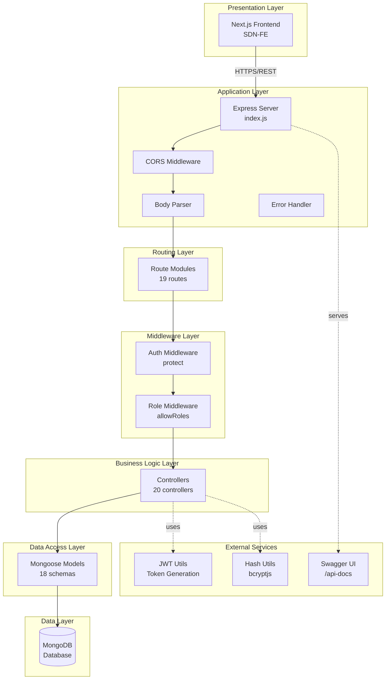
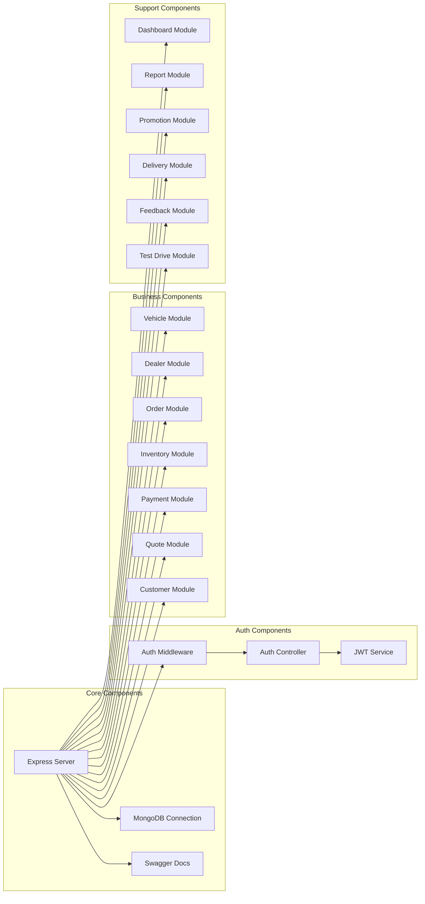
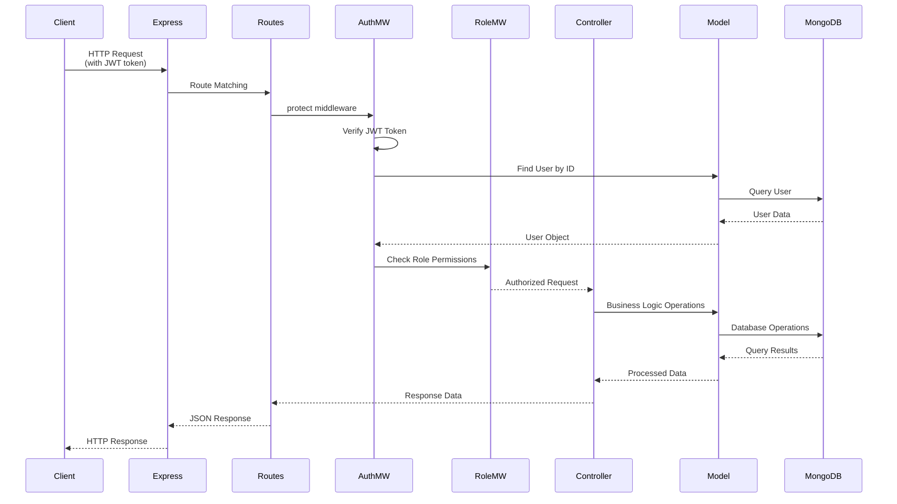
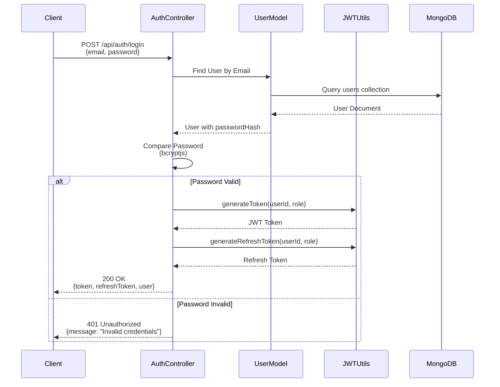
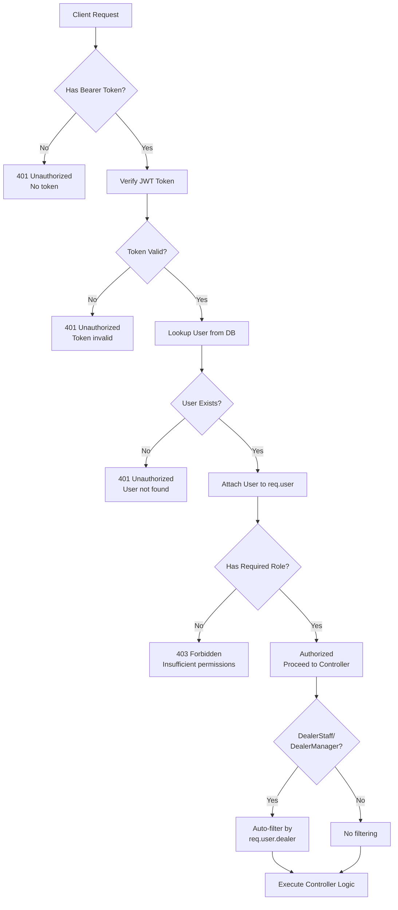
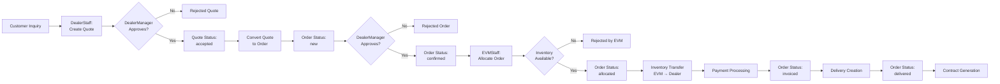
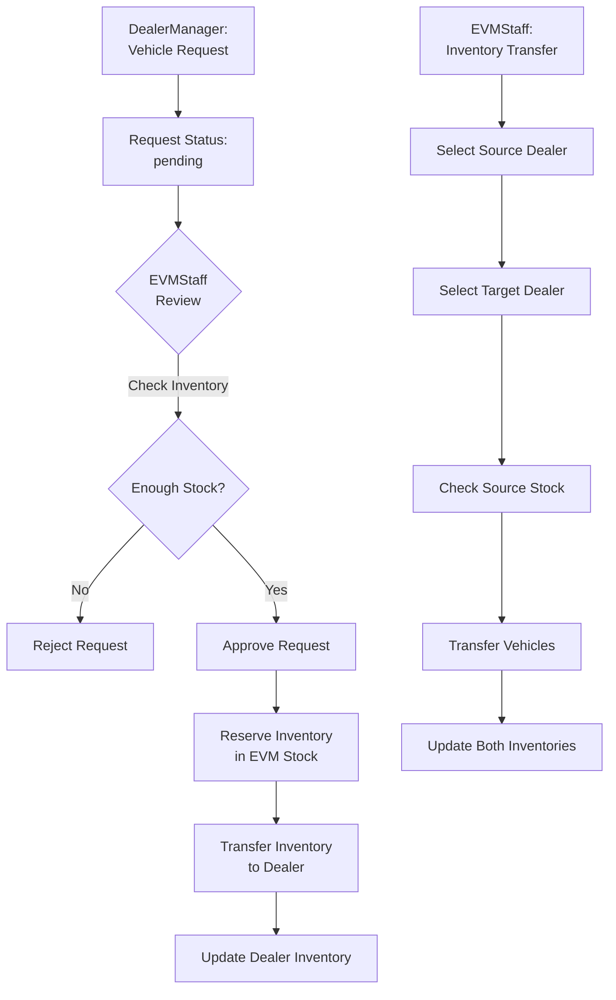

# 🏗️ System Architecture - SDN Backend (EVM)

Tài liệu mô tả kiến trúc hệ thống backend cho **Electric Vehicle Dealer Management System**.

---

## 📋 Mục lục

1. [Tổng quan kiến trúc](#tổng-quan-kiến-trúc)
2. [Layered Architecture](#layered-architecture)
3. [Component Diagram](#component-diagram)
4. [Data Flow](#data-flow)
5. [Authentication & Authorization Flow](#authentication--authorization-flow)
6. [Business Process Flow](#business-process-flow)
7. [Technology Stack](#technology-stack)
8. [API Structure](#api-structure)

---

## 🎯 Tổng quan kiến trúc

```
┌─────────────────────────────────────────────────────────────────┐
│                         CLIENT LAYER                             │
│                    (Next.js Frontend)                            │
│                                                                   │
│  - Dashboard Pages                                               │
│  - CRUD Operations                                               │
│  - Authentication UI                                             │
└───────────────────────┬─────────────────────────────────────────┘
                        │
                        │ HTTPS/REST API
                        │ (Bearer JWT Token)
                        │
┌───────────────────────▼─────────────────────────────────────────┐
│                      API GATEWAY LAYER                           │
│                     (Express.js Server)                          │
│                                                                   │
│  - CORS Configuration                                             │
│  - Request Parsing (JSON/URL-encoded)                            │
│  - Error Handling                                                │
│  - Swagger Documentation                                          │
└───────────────────────┬─────────────────────────────────────────┘
                        │
                        │ Route Dispatch
                        │
┌───────────────────────▼─────────────────────────────────────────┐
│                      ROUTING LAYER                               │
│                    (Express Routes)                              │
│                                                                   │
│  /api/auth          /api/vehicles      /api/dealers              │
│  /api/customers     /api/quotes        /api/orders               │
│  /api/payments      /api/inventory     /api/deliveries            │
│  /api/promotions    /api/reports      /api/dashboard             │
│  ... (19 route modules)                                          │
└───────────────────────┬─────────────────────────────────────────┘
                        │
                        │ Middleware Chain
                        │
┌───────────────────────▼─────────────────────────────────────────┐
│                   MIDDLEWARE LAYER                               │
│                                                                   │
│  ┌─────────────────────────────────────────────────┐            │
│  │  Authentication Middleware (protect)             │            │
│  │  - JWT Token Verification                        │            │
│  │  - User Lookup                                   │            │
│  └─────────────────────────────────────────────────┘            │
│                        │                                          │
│  ┌─────────────────────▼─────────────────────────────┐          │
│  │  Authorization Middleware (allowRoles)             │          │
│  │  - Role-based Access Control                      │          │
│  │  - Permission Checking                            │          │
│  └───────────────────────────────────────────────────┘          │
└───────────────────────┬─────────────────────────────────────────┘
                        │
                        │ Business Logic
                        │
┌───────────────────────▼─────────────────────────────────────────┐
│                    CONTROLLER LAYER                              │
│                   (Business Logic)                                │
│                                                                   │
│  - authController      - vehicleController                        │
│  - orderController     - paymentController                        │
│  - inventoryController - dealerController                         │
│  - quoteController     - customerController                       │
│  ... (20 controller modules)                                     │
└───────────────────────┬─────────────────────────────────────────┘
                        │
                        │ Data Operations
                        │
┌───────────────────────▼─────────────────────────────────────────┐
│                      MODEL LAYER                                 │
│                    (Mongoose ODM)                                │
│                                                                   │
│  - User               - Order          - Payment                  │
│  - VehicleVariant     - Quote          - Delivery                 │
│  - Dealer             - Inventory      - Feedback                 │
│  - Customer           - TestDrive      - Promotion                │
│  ... (18 model schemas)                                          │
└───────────────────────┬─────────────────────────────────────────┘
                        │
                        │ MongoDB Driver
                        │
┌───────────────────────▼─────────────────────────────────────────┐
│                      DATABASE LAYER                              │
│                      (MongoDB)                                   │
│                                                                   │
│  Collections:                                                     │
│  - users              - orders          - payments               │
│  - vehiclevariants    - quotes          - deliveries             │
│  - dealers            - inventory       - feedbacks              │
│  - customers          - testdrives      - promotions              │
│  ...                                                              │
└───────────────────────────────────────────────────────────────────┘
```

---

## 🏛️ Layered Architecture



---

## 🔧 Component Diagram



---

## 🔄 Data Flow

### Request Flow



### Authentication Flow



---

## 🔐 Authentication & Authorization Flow



### Role Hierarchy & Permissions

```
Admin
  ├── Full System Access
  ├── User Management
  ├── Dealer Management
  └── All EVM Staff permissions

EVMStaff
  ├── Vehicle Management (Model/Variant/Color)
  ├── Global Inventory Management
  ├── Order Allocation & Approval
  ├── Dealer Target Management
  ├── Promotion Management
  └── System Reports

DealerManager
  ├── Staff Management (within dealer)
  ├── Quote Approval
  ├── Order Approval
  ├── Payment Confirmation
  ├── Delivery Status Update
  ├── Inventory Management (within dealer)
  ├── Customer Management
  └── Dealer Reports

DealerStaff
  ├── Vehicle Viewing & Comparison
  ├── Customer Management
  ├── Quote Creation
  ├── Order Creation
  ├── Payment Creation
  ├── Delivery Creation
  └── Feedback Creation
```

---

## 📊 Business Process Flow

### Sales Flow (Quote → Order → Delivery)



### Inventory Management Flow



---

## 🛠️ Technology Stack

### Core Technologies

| Layer | Technology | Version | Purpose |
|-------|-----------|---------|---------|
| **Runtime** | Node.js | Latest LTS | JavaScript runtime |
| **Framework** | Express.js | ^5.1.0 | Web application framework |
| **Database** | MongoDB | Latest | NoSQL document database |
| **ODM** | Mongoose | ^8.18.3 | MongoDB object modeling |

### Dependencies

| Package | Version | Purpose |
|---------|---------|---------|
| `express` | ^5.1.0 | Web framework |
| `mongoose` | ^8.18.3 | MongoDB ODM |
| `jsonwebtoken` | ^9.0.2 | JWT authentication |
| `bcryptjs` | ^3.0.2 | Password hashing |
| `cors` | ^2.8.5 | Cross-origin resource sharing |
| `dotenv` | ^17.2.3 | Environment variables |
| `swagger-ui-express` | ^5.0.1 | API documentation |
| `express-async-handler` | ^1.2.0 | Async error handling |

---

## 📡 API Structure

### API Endpoints Overview

```
/api
├── /auth                    Authentication & User Management
│   ├── POST   /login        User login
│   ├── POST   /register     User registration
│   ├── GET    /me           Get current user profile
│   └── POST   /refresh      Refresh JWT token
│
├── /vehicles                Vehicle Variants Management
│   ├── GET    /             List all variants
│   ├── GET    /:id          Get variant details
│   ├── GET    /compare      Compare variants
│   ├── POST   /             Create variant (EVMStaff, Admin)
│   ├── PUT    /:id          Update variant (EVMStaff, Admin)
│   └── DELETE /:id          Delete variant (Admin)
│
├── /vehicle-models          Vehicle Models Management
│   └── [CRUD operations]
│
├── /vehicle-colors          Vehicle Colors Management
│   └── [CRUD operations]
│
├── /dealers                 Dealer Management
│   ├── GET    /             List dealers
│   ├── GET    /:id          Get dealer details
│   ├── POST   /             Create dealer (Admin)
│   ├── PATCH  /:id          Update dealer
│   ├── DELETE /:id          Delete dealer (Admin)
│   └── GET    /:id/inventory Get dealer inventory
│
├── /customers               Customer Management (CRM)
│   └── [CRUD operations]
│
├── /quotes                  Quote Management
│   ├── POST   /             Create quote
│   ├── PUT    /:id/approve  Approve quote (DealerManager)
│   ├── PUT    /:id/reject   Reject quote (DealerManager)
│   └── PUT    /:id/convert  Convert to order
│
├── /orders                  Order Management
│   ├── POST   /             Create order
│   ├── PUT    /:id/approve  Approve order (DealerManager)
│   ├── PUT    /:id/allocate Allocate order (EVMStaff)
│   ├── PUT    /:id/status   Update order status
│   └── [Other operations]
│
├── /payments                Payment Management
│   └── [CRUD operations]
│
├── /inventory               Inventory Management
│   ├── GET    /             List inventory
│   ├── POST   /             Create inventory item
│   ├── POST   /transfer     Transfer between dealers (EVMStaff)
│   └── [Other operations]
│
├── /deliveries              Delivery Management
│   └── [CRUD operations]
│
├── /contracts               Contract Management
│   └── [CRUD operations]
│
├── /promotions              Promotion Management
│   └── [CRUD operations]
│
├── /test-drives             Test Drive Management
│   └── [CRUD operations]
│
├── /feedbacks               Feedback Management
│   └── [CRUD operations]
│
├── /reports                 Reporting
│   ├── GET    /sales        Sales report
│   ├── GET    /debt         Debt report
│   └── GET    /inventory    Inventory report
│
├── /dashboard               Dashboard Analytics
│   ├── GET    /summary      Summary statistics
│   └── GET    /trends       Trend analysis
│
└── /users                   User Management
    └── [CRUD operations]
```

### Request/Response Format

**Request Headers:**
```
Authorization: Bearer <jwt_token>
Content-Type: application/json
```

**Success Response:**
```json
{
  "success": true,
  "data": { ... }
}
```

**Error Response:**
```json
{
  "message": "Error description",
  "error": "Error details (development only)"
}
```

---

## 📁 Project Structure

```
SDN-BE/
├── index.js                    # Application entry point
├── package.json                # Dependencies & scripts
├── .env                        # Environment variables
│
├── controllers/                # Business logic layer
│   ├── authController.js
│   ├── vehicleController.js
│   ├── orderController.js
│   ├── quoteController.js
│   └── ... (20 controllers)
│
├── models/                     # Data models (Mongoose schemas)
│   ├── User.js
│   ├── VehicleVariant.js
│   ├── Order.js
│   ├── Quote.js
│   └── ... (18 models)
│
├── routes/                     # API route definitions
│   ├── authRoutes.js
│   ├── vehicleRoutes.js
│   ├── orderRoutes.js
│   └── ... (19 route files)
│
├── middleware/                 # Custom middleware
│   └── authMiddleware.js       # JWT authentication & authorization
│
├── utils/                      # Utility functions
│   ├── jwt.js                  # JWT token generation/verification
│   └── hash.js                 # Password hashing utilities
│
├── swagger.json                # API documentation
│
└── seed.js                     # Database seeding script
```

---

## 🔒 Security Architecture

### Authentication & Authorization

1. **JWT-based Authentication**
   - Token generation with user ID and role
   - Token expiration: 1 day (access), 7 days (refresh)
   - Bearer token in Authorization header

2. **Role-Based Access Control (RBAC)**
   - 4 roles: Admin, EVMStaff, DealerManager, DealerStaff
   - Middleware-based permission checking
   - Auto-filtering by dealer for dealer roles

3. **Password Security**
   - Bcrypt hashing with salt rounds
   - Passwords never stored in plain text

### Data Security

- Environment variables for sensitive data (JWT_SECRET, MONGO_URI)
- MongoDB connection with authentication
- Input validation at controller level
- Error messages sanitized in production

### CORS Configuration

- Configurable CORS policies
- Preflight request handling
- Credential support (configurable)

---

## 🚀 Deployment Architecture

```
┌─────────────────────────────────────────────────────────┐
│                    Production Environment                │
│                                                          │
│  ┌──────────────┐          ┌──────────────┐            │
│  │   Render     │          │   MongoDB    │             │
│  │   (Hosting)  │◄─────────┤   Atlas      │             │
│  │              │   HTTPS  │   (Cloud DB) │             │
│  │  Express App │          │              │             │
│  └──────┬───────┘          └──────────────┘            │
│         │                                                 │
│         │ HTTPS/REST API                                  │
│         │                                                 │
│  ┌──────▼───────┐                                        │
│  │  Next.js FE  │                                        │
│  │  (Client)    │                                        │
│  └──────────────┘                                        │
└─────────────────────────────────────────────────────────┘
```

### Environment Configuration

- **Development**: Local MongoDB, PORT 5000
- **Production**: MongoDB Atlas, Render hosting
- Health check endpoint for monitoring
- Graceful shutdown handling

---

## 📈 Scalability Considerations

1. **Stateless Design**: JWT tokens enable horizontal scaling
2. **MongoDB Sharding**: Ready for database scaling
3. **Async Operations**: Non-blocking I/O with Express
4. **Connection Pooling**: Mongoose connection management
5. **Caching Ready**: Can integrate Redis for session/token caching

---

## 📝 Notes

- All endpoints require authentication except `/api/auth/login` and `/api/auth/register`
- DealerStaff and DealerManager automatically filter data by their dealer
- Error handling is centralized in Express error middleware
- API documentation available at `/api-docs` (Swagger UI)
- Health check endpoint: `/health`

---

**Last Updated**: 2024
**Version**: 1.0.0

